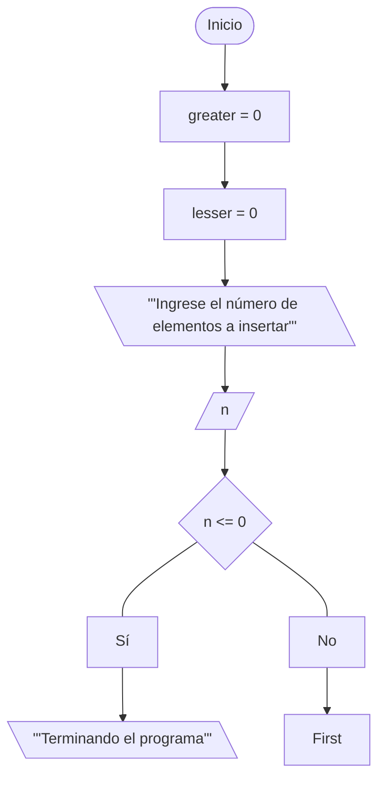

```mermaid
flowchart TB
Start([Inicio])
DeclarationOfGreater[greater = 0]
DeclarationOfLesser[lesser = 0]
StartMessage[\ '"Ingrese el número de elementos a insertar"'\]
ReadN[/n/]
IfNSmallerThanOrEqualToZero{n <= 0}
FinalizationMessage[\'"Terminando el programa"'\]
Something["First"]

Start --> DeclarationOfGreater
DeclarationOfGreater --> DeclarationOfLesser
DeclarationOfLesser --> StartMessage
StartMessage --> ReadN
ReadN --> IfNSmallerThanOrEqualToZero
IfNSmallerThanOrEqualToZero ---Sí--> FinalizationMessage
IfNSmallerThanOrEqualToZero ---No--> Something
```
