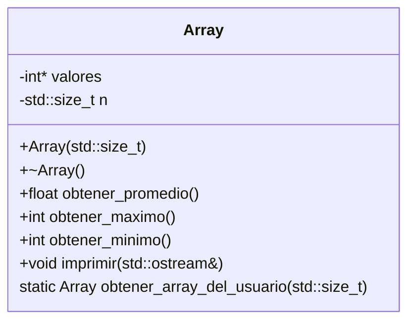

El propósito de este proyecto es conjugar la funcionalidad [[Promedio de una Array. README|del proyecto del promedio]] y del [[Mínimo y Máximo de una Array. README|mínimo y máximo]] en uno solo, poniendo las funciones auxiliares en una clase llamada `Array` que guarda registro de sus elementos y la cantidad de los mismos, en dos variables privadas llamadas `valores` y `n`, respectivamente; el equivalente de la función `obtener_array_del_usuario` debería ser un miembro estático de `Array`, y además debería haber una función llamada `imprimir` que muestre los valores de `Array` en pantalla. `Array` debería tener un [[Constructor|constructor]] que tome `n` e inicialice la memoria para los valores, así como un [[Destructor|destructor]] que libere la memoria de sus `valores` al final del programa. El programa en `main` debería ser una llamada a imprimir a una variable `Array` de 10 elementos obtenida por una llamada a `obtener_array_del_usuario`.

La información de las [[Firma de la función|firmas]] de los métodos de `Array` se condensa en el siguiente diagrama y snippet:



```cpp
class Array {
  private:
    std::size_t n;
    int* valores;

  public:
    Array(std::size_t);
    ~Array();
    float obtener_promedio();
    int obtener_minimo();
    int obtener_maximo();
    void imprimir();

    static Array obtener_array_del_usuario(std::size_t n);
};
```

La explicación de los métodos de `Array` así como posibles implementaciones se detallan a continuación

# Array::Array(std::size_t)

```cpp
Array::Array(std::size_t n);
```

| Parámetro | Explicación |
| ---- | ---- |
| `n` | El número de elementos que manejará esta instancia de `Array` |

Este [[Constructor|constructor]] de `Array` se encarga de inicializar el valor de `n` según el parámetro dado, y también de crear el [[Puntero|puntero]] a la memoria reservada para sus `valores`.

Ejemplo de implementación:
```cpp
Array::Array(std::size_t n): n(n), valores(new int[n]) {}
```

# Array::~Array()

```cpp
Array::~Array();
```

Este [[Destructor|destructor]] de `Array` se encarga de liberar la memoria de sus `valores` usando la palabra reservada `delete[]` (importante usar los corchetes, dado que se está eliminando una array y no un solo valor en memoria) y manejando casos extremos en los que la cantidad de elementos o el puntero hacia los mismos son inválidos.

Ejemplo de implementación:
```cpp
Array::~Array() {
  if (n > 0 && valores != nullptr) {
    delete[] valores;
  }
}
```

# float Array::obtener_promedio()

```cpp
float Array::obtener_promedio();
```

El propósito de esta función es el mismo que [[Promedio de una Array. README#Obtener promedio|obtener promedio]] del proyecto 2.

Ejemplo de implementación:
```cpp
float Array::obtener_promedio() {
  if (n == 0) return 0;
  float promedio = 0;
  for (int i = 0; i < n; i++) {
    promedio += array[i];
  }
  return promedio / (float) n;
}
```

# int Array::obtener_maximo()

```cpp
int Array::obtener_maximo();
```

El propósito de esta función es el mismo que [[Mínimo y Máximo de una Array. README#Obtener máximo|obtener máximo]] del proyecto 1.

Ejemplo de implementación:
```cpp
int Array::obtener_maximo() {
  if (n == 0) throw "No se puede obtener el máximo de una array de cero elementos";
  int maximo = valores[0];
  for (int i = 1; i < n; i++) {
    const int valor = valores[i];
    if (valor > maximo) maximo = valor;
  }
  return maximo;
}
```

# int Array::obtener_minimo()

```cpp
int Array::obtener_minimo();
```

El propósito de esta función es el mismo que [[Mínimo y Máximo de una Array. README#Obtener mínimo|obtener mínimo]] del proyecto 1.

Ejemplo de implementación:
```cpp
int Array::obtener_minimo() {
  if (n == 0) throw "No se puede obtener el mínimo de una array de cero elementos";
  int minimo = valores[0];
  for (int i = 1; i < n; i++) {
    const int valor = valores[i];
    if (valor < minimo) minimo = valor;
  }
  return minimo;
}
```

# void Array::imprimir()

```cpp
void Array::imprimir();
```

Esta función debería imprimir los valores calculados por [[#int Array obtener_maximo()|obtener máximo]], [[#int Array obtener_minimo()|obtener mínimo]] y [[#float Array obtener_promedio()|obtener promedio]] de manera amigable al usuario.

Ejemplo de implementación:
```cpp
void Array::imprimir() {
  std::cout << "Imprimiendo valores de la `Array`" << std::endl;
  std::cout << "\tEl promedio es: " << obtener_promedio() << std::endl;
  std::cout << "\tEl máximo es: " << obtener_maximo() << std::endl;
  std::cout << "\tEl mínimo es: " << obtener_minimo() << std::endl;
  std::cout << "Fin de la impresión de la `Array`" << std::endl;
}
```

# Array Array::obtener_array_del_usuario(std::size_t n)

| Parámetro | Explicación |
| ---- | ---- |
| `n` | Longitud de la array a crear; de tipo `std::size_t` dado que es más semánticamente correcto |

El propósito de esta función es el mismo que [[Mínimo y Máximo de una Array. README#Obtener array del usuario|obtener array del usuario]] del proyecto 1.

Ejemplo de implementación:
```cpp
Array Array::obtener_array_del_usuario(std::size_t n) {
  Array array(n);
  for (int i = 0; i < n; i++) {
    int value;

    std::cout << "Ingrese el siguiente número en la lista: ";
    std::cin >> value;
    array.valores[i] = value;
  }
  return array;
}
```

# Main

La función `main` debería lograr el propósito descrito al inicio de este documento; una implementación posible (omitiendo la implementación de las funciones miembro detalladas anteriormente) es la siguiente:

```cpp
#include <cstdlib>
#include <iostream>

class Array {
  private:
    std::size_t n;
    int* valores;

  public:
    Array(std::size_t);
    ~Array();
    float obtener_promedio();
    int obtener_minimo();
    int obtener_maximo();
    void imprimir();

    static Array obtener_array_del_usuario(std::size_t n);
};

int main() {
  Array array = Array::obtener_array_del_usuario(10);
  array.imprimir();

  return EXIT_SUCCESS;
}
```
