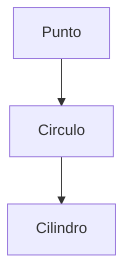

Este proyecto tiene como propósito implementar la funcionalidad de las clases en C++ utilizando la herencia; se empezó el día 2024-01-22 y tiene las clases `Punto`, `Circulo`, `Cilindro`, siguiendo la jerarquía que viene:



Este proyecto es el mismo que el de [[Figuras Geométricas. README|figuras geométricas]], pero implementando la herencia para evitar reutilizar código (según el criterio del profe, con el cual estoy en desacuerdo).

# Polimorfismo

"Polimorfismo" es una palabra que viene de las raíces griegas *poly* y *morphos*, que significan "mucho" y "formas", de modo que "polimorfismo" hace referencia a la capacidad de adoptar múltiples formas.

El polimorfismo en C++ se expresa en la habilidad de poder asignar una clase derivada a una variable declarada como una clase base.

```cpp
#include <iostream>
#include <cstdlib>

class Base {
	protected:
	int value;

	public:
	Base(int value): value(value) {
		std::cout << "Llamando al constructor de la base" << std::endl;
	}
};

class Derivada : public Base {
	public:
	Derivada(int value): Base(value) {
		std::cout << "Llamando al constructor de la derivada" << std::endl;
	}
};

int main() {
	Base* base = new Base(5); // `base` se declara de tipo `Base`
	base = new Derivada(105); // `base` recibe un valor de tipo `Derivada`
	return EXIT_SUCCESS;
}
```

